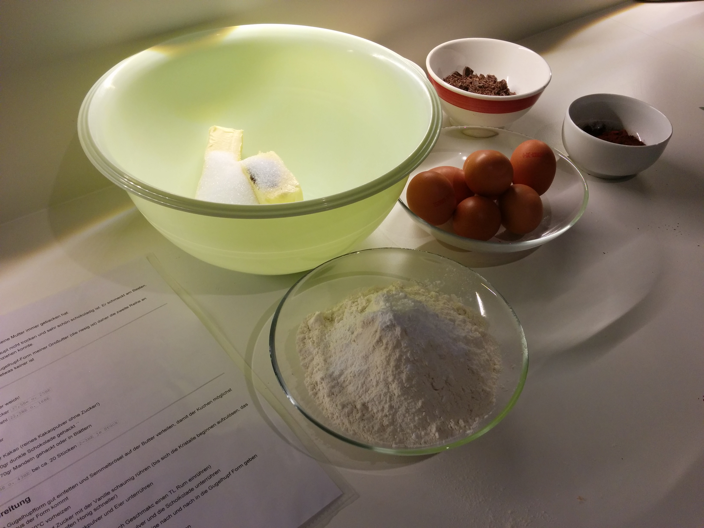

# VitePress Migration Plan - Detailliert

## Übersicht

Dieser Plan beschreibt die vollständige Migration des Rezepte-Repositories zu einer VitePress-Website mit automatischem GitHub Pages Deployment.

**Ausgangssituation:**
- 67 Markdown-Dateien im Root-Verzeichnis (66 Rezepte + MIGRATION.md)
- 3 Ordner mit Bildern: `Brownies_w_Almonds/` (10 JPG), `Marmorkuchen/` (4 JPG), `zimtschnecken/` (7 PNG)
- 21 Bilder total, jeweils 1-4 MB groß (~30 MB gesamt)
- Keine Build-Konfiguration vorhanden
- Branch `feature/vitepress` bereits erstellt ✓
- Detaillierter Migrationsplan in MIGRATION.md erstellt ✓

**Ziele:**
- ✅ Schöne HTML-Website statt einfacher Markdown-Dateien
- ✅ Alphabetische Liste mit späterer Tag-basierter Gruppierung
- ✅ Volltext-Suche über alle Rezepte
- ✅ Dark Mode Support
- ✅ Automatisches Deployment zu GitHub Pages
- ✅ Responsive Design für mobile Geräte

---

## Kritische Dateien

Diese 5 Dateien sind zentral für die Migration:

1. **[docs/.vitepress/config.js](docs/.vitepress/config.js)** - VitePress Hauptkonfiguration
2. **[docs/recipes/marmorkuchen/index.md](docs/recipes/marmorkuchen/index.md)** - Beispiel Rezept mit Bildern (Ordner-Struktur)
3. **[docs/recipes/kaesekuchen.md](docs/recipes/kaesekuchen.md)** - Beispiel Rezept ohne Bilder (Datei-Struktur)
4. **[.github/workflows/deploy.yml](.github/workflows/deploy.yml)** - GitHub Actions Deployment
5. **[docs/.vitepress/theme/TagsLayout.vue](docs/.vitepress/theme/TagsLayout.vue)** - Tag-Filter-System

---

## Phase 1: Projekt-Setup

### 1.1 NPM Initialisierung

```bash
npm init -y
```

Danach [package.json](package.json) manuell anpassen mit:
- Scripts für dev, build, preview
- VitePress und Vue als devDependencies
- Sharp für Bildoptimierung

### 1.2 Dependencies installieren

```bash
npm install -D vitepress vue
npm install sharp
```

### 1.3 Ordnerstruktur erstellen

```
recipes/
├── docs/
│   ├── .vitepress/
│   │   ├── config.js           # Hauptkonfiguration
│   │   └── theme/
│   │       ├── index.js        # Theme-Erweiterung
│   │       ├── TagsLayout.vue  # Tag-Filter-Komponente
│   │       └── recipes.data.js # Rezept-Daten-Loader
│   ├── public/                 # Nur für allgemeine Assets (favicon etc.)
│   ├── recipes/                # Alle Rezept-Dateien
│   │   ├── index.md            # Übersichtsseite
│   │   ├── brownies_w_almonds/ # Rezept mit Bildern (Ordner)
│   │   │   ├── index.md
│   │   │   └── *.jpg (10 Bilder)
│   │   ├── marmorkuchen/       # Rezept mit Bildern (Ordner)
│   │   │   ├── index.md
│   │   │   └── *.jpg (4 Bilder)
│   │   ├── schwedische_zimtschnecken/ # Rezept mit Bildern (Ordner)
│   │   │   ├── index.md
│   │   │   └── *.png (7 Bilder)
│   │   ├── kaesekuchen.md      # Rezept ohne Bilder (Datei)
│   │   ├── muerbeteig.md       # Rezept ohne Bilder (Datei)
│   │   └── ... (63 weitere .md Dateien)
│   └── index.md                # Startseite
├── .github/workflows/
│   └── deploy.yml              # GitHub Actions
└── scripts/
    └── optimize-images.js      # Bildoptimierung (optional)
```

**VitePress Routing:**
- `docs/recipes/marmorkuchen/index.md` → `/recipes/marmorkuchen/`
- `docs/recipes/kaesekuchen.md` → `/recipes/kaesekuchen`
- Beide Ansätze funktionieren parallel!

### 1.4 .gitignore erweitern

Neue Einträge:
```
node_modules/
docs/.vitepress/dist
docs/.vitepress/cache
.DS_Store
```

---

## Phase 2: VitePress Konfiguration

### 2.1 Basis-Konfiguration erstellen

**Datei:** [docs/.vitepress/config.js](docs/.vitepress/config.js)

**Wichtige Einstellungen:**
- `base: '/recipes/'` - muss dem GitHub Repository-Namen entsprechen
- Automatische Sidebar-Generierung aus recipes/ Ordner
- Lokalisierte Suche (deutsche Übersetzungen)
- Dark Mode (standardmäßig aktiviert)
- Navigation mit Home + Recipes-Link

**Funktion `getRecipesSidebar()`:**
Liest automatisch alle .md Dateien aus docs/recipes/ und generiert alphabetisch sortierte Sidebar-Links.

### 2.2 Startseite erstellen

**Datei:** [docs/index.md](docs/index.md)

Layout: VitePress Home-Layout mit Hero-Section und Features:
- Hero mit Titel "Rezepte" und Call-to-Action Buttons
- 4 Feature-Karten: Kuchen & Torten, Gebäck, Suche, Tags
- Icons: 🍰 🥐 🔍 🏷️

### 2.3 Rezepte-Übersichtsseite

**Datei:** [docs/recipes/index.md](docs/recipes/index.md)

Initial: Einfache Seite mit Verweis auf Sidebar und Suche.
Später (Phase 5): Wird mit TagsLayout-Komponente erweitert.

---

## Phase 3: Content-Migration

### 3.1 Frontmatter-Template

**Jedes Rezept erhält Frontmatter für Metadaten und Tags:**

```yaml
---
title: "Rezeptname"
description: "Kurzbeschreibung"
tags:
  - kategorie
  - hauptzutat
  - eigenschaft
hasImages: true/false
portions: "Anzahl Portionen"
difficulty: "einfach/mittel/aufwändig"
time: "Zubereitungszeit"
lastUpdated: true
---
```

**Tag-Kategorien:**
- **Rezepttyp:** kuchen, torte, gebäck, cookies, muffins, brot, grundrezept, dessert, sauce, herzhaft
- **Hauptzutat:** schokolade, nüsse, mandeln, früchte, äpfel, beeren, käse, hefe
- **Eigenschaften:** einfach, mittel, aufwändig, schnell, vegan, vegetarisch
- **Anlass:** weihnachten, advent, klassiker
- **Herkunft:** amerikanisch, schwedisch, italienisch

### 3.2 Rezepte migrieren

**Zwei verschiedene Migrations-Wege:**

#### A. Rezepte MIT Bildern (3 Stück) → Als Ordner

**Betroffene Rezepte:**
1. `brownies_w_almonds.md` + `Brownies_w_Almonds/` (10 JPG)
2. `marmorkuchen.md` + `Marmorkuchen/` (4 JPG)
3. `schwedische_zimtschnecken.md` + `zimtschnecken/` (7 PNG)

**Schritte:**

1. Bildordner umbenennen (lowercase):
   - `Brownies_w_Almonds/` → `brownies_w_almonds/`
   - `Marmorkuchen/` → `marmorkuchen/`
   - `zimtschnecken/` → `zimtschnecken/` (bereits korrekt)

2. Ordner nach `docs/recipes/` verschieben

3. Rezept-Datei umbenennen und in Ordner verschieben:
   - `brownies_w_almonds.md` → `docs/recipes/brownies_w_almonds/index.md`
   - `marmorkuchen.md` → `docs/recipes/marmorkuchen/index.md`
   - `schwedische_zimtschnecken.md` → `docs/recipes/schwedische_zimtschnecken/index.md`

4. Frontmatter hinzufügen

5. Bildpfade anpassen zu **relativen Pfaden**: `Folder/img.jpg` → `./img.jpg`

6. Cross-References anpassen: `[Text](File.md)` → `[Text](/recipes/file)`

**Pfad-Anpassungen mit Regex (pro Rezept in der index.md):**

| Datei | Suchen | Ersetzen |
|-------|--------|----------|
| brownies_w_almonds/index.md | `!\[(.*?)\]\(Brownies_w_Almonds/([^)]+)\)` | `` |
| marmorkuchen/index.md | `!\[(.*?)\]\(Marmorkuchen/([^)]+)\)` | `` |
| schwedische_zimtschnecken/index.md | `!\[(.*?)\]\(\./zimtschnecken/([^)]+)\)` | `` |

**Beispiel für marmorkuchen:**

**Vorher (Root):**
```markdown
# Marmorkuchen

das ist ein marmorkuchen...




s. [Mandelmehl](Mandelmehl.md)
```

**Nachher (docs/recipes/marmorkuchen/index.md):**
```markdown
---
title: "Marmorkuchen"
description: "Saftiger Marmorkuchen nach Omas Rezept, nicht trocken und sehr schön schokoladig"
tags:
  - kuchen
  - schokolade
  - klassiker
  - gugelhupf
hasImages: true
portions: "20 Stücke"
difficulty: "mittel"
time: "75 Minuten"
lastUpdated: true
---

# Marmorkuchen

das ist ein marmorkuchen...


s. [Mandelmehl](/recipes/mandelmehl)
```

**Resultierende Struktur:**
```
docs/recipes/marmorkuchen/
├── index.md
├── 01_vorbereitung.jpg
├── 02_zwischenschritt.jpg
├── 03_backen.jpg
└── 04_nach_dem_backen.jpg
```

---

#### B. Rezepte OHNE Bilder (63 Stück) → Als einzelne Dateien

**Schritte:**

1. Datei von Root direkt nach `docs/recipes/` verschieben
2. Frontmatter am Anfang hinzufügen
3. Cross-References anpassen: `[Text](File.md)` → `[Text](/recipes/file)`

**Cross-References Regex (für alle Rezepte):**

| Suchen | Ersetzen | Zweck |
|--------|----------|-------|
| `\[(.*?)\]\(([A-Z][a-zA-Z]+)\.md\)` | `[$1](/recipes/\L$2)` | Großbuchstaben → lowercase |
| `\[(.*?)\]\(([a-z_-]+)\.md\)` | `[$1](/recipes/$2)` | Lowercase, .md entfernen |
| `\[(.*?)\]\(\.\/([a-z_-]+)\.md\)` | `[$1](/recipes/$2)` | Mit `./` Präfix |

**Beispiel für kaesekuchen.md:**

**Vorher:**
```markdown
# Käsekuchen

siehe [Mürbeteig Grundrezept](Muerbeteig.md)

## Zutaten
...
```

**Nachher (docs/recipes/kaesekuchen.md):**
```markdown
---
title: "Käsekuchen"
description: "Klassischer Käsekuchen mit Mürbeteig"
tags:
  - kuchen
  - käse
  - klassiker
hasImages: false
difficulty: "mittel"
time: "90 Minuten"
lastUpdated: true
---

# Käsekuchen

siehe [Mürbeteig Grundrezept](/recipes/muerbeteig)

## Zutaten
...
```

---

**Cross-References funktionieren für beide Strukturen:**
```markdown
[Marmorkuchen](/recipes/marmorkuchen)  <!-- Ordner mit index.md -->
[Käsekuchen](/recipes/kaesekuchen)     <!-- Einzelne .md Datei -->
```

VitePress behandelt beide URLs korrekt!

**Besondere Aufmerksamkeit:**
- Bilingual-Rezepte (beide Sprachen prüfen): brownies_w_almonds, schwedische_zimtschnecken
- Rezepte mit Cross-References: erdbeerkuchen → biskuitboden_grundrezept, chocolate_almond_cake → mandelmehl, kaesekuchen → muerbeteig

### 3.3 Bilder migrieren

**Die Bilder bleiben bei den Rezepten!**

Dies wurde bereits in Phase 3.2 A erledigt:
- Bildordner wurden in die entsprechenden Rezeptordner integriert
- Bilder liegen jetzt direkt neben ihren `index.md` Dateien

**Resultierende Struktur:**
```
docs/recipes/
├── brownies_w_almonds/
│   ├── index.md
│   └── IMG_*.jpg (10 Bilder)
├── marmorkuchen/
│   ├── index.md
│   └── 0*.jpg (4 Bilder)
└── schwedische_zimtschnecken/
    ├── index.md
    └── *.png (7 Bilder)
```

**Keine separate `/images/` Struktur nötig!**

---

## Phase 4: Bildoptimierung

### 4.1 Problem

Aktuelle Bilder sind 1-4 MB groß:
- ❌ Lange Ladezeiten
- ❌ Hoher Bandbreitenverbrauch
- ❌ Schlechte Mobile-Performance

**Ziele:**
- ✅ Header-Bilder: < 200 KB
- ✅ Inline-Bilder: < 100 KB
- ✅ Max. Breite: 1200px
- ✅ Qualität: 75-85%

### 4.2 Automatische Optimierung

**Datei:** [scripts/optimize-images.js](scripts/optimize-images.js)

Das Script nutzt Sharp zum:
- Resize auf max. 1200px Breite
- JPEG-Kompression mit mozjpeg
- Erstellen optimierter Versionen (`*_optimized.jpg`)
- Ausgabe der Größeneinsparung

**Ausführen:**
```bash
npm run optimize-images
```

Nach der Optimierung: Manuell prüfen und Originale ersetzen.

**Alternative:** Manuelle Optimierung mit ImageOptim, GIMP oder tinypng.com

---

## Phase 5: Tags & Filterung

### 5.1 Tag-System implementieren

**3 neue Dateien:**

1. **[docs/.vitepress/theme/index.js](docs/.vitepress/theme/index.js)**
   - Erweitert VitePress Default-Theme
   - Registriert TagsLayout-Komponente

2. **[docs/.vitepress/theme/TagsLayout.vue](docs/.vitepress/theme/TagsLayout.vue)**
   - Vue-Komponente für Tag-basierte Filterung
   - Zeigt alle Tags als anklickbare Buttons
   - Filtert Rezepte nach ausgewähltem Tag
   - Zeigt Rezept-Karten mit Titel, Beschreibung, Tags

3. **[docs/.vitepress/theme/recipes.data.js](docs/.vitepress/theme/recipes.data.js)**
   - VitePress Data Loader
   - Liest alle Rezepte aus docs/recipes/
   - Extrahiert Frontmatter
   - Sortiert alphabetisch

### 5.2 Integration

**[docs/recipes/index.md](docs/recipes/index.md) aktualisieren:**

```markdown
---
title: Alle Rezepte
layout: page
---

<TagsLayout />
```

Das ersetzt die Platzhalter-Seite durch die interaktive Tag-Filter-Ansicht.

---

## Phase 6: GitHub Actions Deployment

### 6.1 Workflow erstellen

**Datei:** [.github/workflows/deploy.yml](.github/workflows/deploy.yml)

**Workflow-Trigger:** Push auf `master` Branch

**Jobs:**
1. **Build:**
   - Checkout mit vollständiger History (für lastUpdated)
   - Node.js 20 Setup
   - npm ci (install dependencies)
   - npm run docs:build
   - Upload Build-Artefakt

2. **Deploy:**
   - Deploy zu GitHub Pages
   - Benötigt Permissions: contents:read, pages:write, id-token:write

### 6.2 GitHub Pages aktivieren

**Auf GitHub.com:**
1. Repository → Settings → Pages
2. Source: **GitHub Actions** (nicht "Deploy from a branch")
3. Custom Domain: optional

### 6.3 Base Path prüfen

**In [docs/.vitepress/config.js](docs/.vitepress/config.js):**
- Repository heißt "recipes": `base: '/recipes/'`
- Custom Domain: `base: '/'`

---

## Phase 7: Testing & Validierung

### 7.1 Lokaler Dev-Server

```bash
npm run docs:dev
```

**Öffne:** http://localhost:5173

**Checkliste:**
- [ ] Startseite lädt
- [ ] Sidebar zeigt alle Rezepte alphabetisch
- [ ] Suche funktioniert (Rezeptname, Zutaten)
- [ ] Dark Mode Toggle (oben rechts)
- [ ] 5+ Rezepte öffnen und prüfen:
  - [ ] Bilder angezeigt
  - [ ] Cross-References funktionieren
  - [ ] Frontmatter nicht sichtbar
  - [ ] Bilingual-Layout korrekt
- [ ] Tag-Filter funktioniert
- [ ] Mobile Ansicht (responsive)

### 7.2 Build testen

```bash
npm run docs:build
npm run docs:preview
```

**Öffne:** http://localhost:4173

**Checkliste:**
- [ ] Build erfolgreich
- [ ] Keine 404-Fehler (Browser Console)
- [ ] Bilder laden
- [ ] Links funktionieren

### 7.3 Post-Deployment

**Nach GitHub Pages Deploy:**
- [ ] Seite erreichbar unter `https://USERNAME.github.io/recipes/`
- [ ] Alle Bilder laden
- [ ] Interne Links funktionieren
- [ ] Suche funktioniert
- [ ] Mobile Performance gut
- [ ] Lighthouse Score > 90

### 7.4 Content-Stichproben

**Zu testen:**
- [ ] brownies_w_almonds (mit Bildern, bilingual)
- [ ] muerbeteig (Grundrezept ohne Bilder)
- [ ] schwedische_zimtschnecken (bilingual mit Bildern)
- [ ] erdbeerkuchen (mit Cross-Reference zu biskuitboden)
- [ ] kaesekuchen (mit Reference zu muerbeteig)

---

## Phase 8: Cleanup & Dokumentation

### 8.1 Repository aufräumen

Nach erfolgreicher Migration:
- [ ] Alte Rezepte aus Root löschen (nur in docs/recipes/)
- [ ] Alte Bildordner aus Root löschen (nur in docs/recipes/)
- [ ] Alte MIGRATION.md aus Root löschen

### 8.2 README.md erstellen

**Datei:** [README.md](README.md)

**Inhalt:**
- Link zur Live-Version
- Lokale Entwicklung (Installation, Dev-Server, Build)
- Anleitung: Neues Rezept hinzufügen
- Technologie-Stack
- Feature-Liste

### 8.3 Finaler Commit

```bash
git add .
git commit -m "feat: migrate to VitePress

- Setup VitePress configuration
- Migrate all 66 recipes to docs/recipes/
- Add frontmatter with tags
- Optimize and move images
- Implement tag-based filtering
- Setup GitHub Actions deployment

🤖 Generated with Claude Code
Co-Authored-By: Claude Sonnet 4.5 <noreply@anthropic.com>"

git push origin feature/vitepress
```

Dann: Pull Request erstellen, reviewen, mergen → automatisches Deployment.

---

## Migrations-Reihenfolge

**Empfohlene Schritte:**

1. ✅ **Phase 1:** Projekt-Setup (npm, VitePress, Ordner)
2. ✅ **Phase 2:** VitePress Konfiguration (config.js, Startseite)
3. ✅ **Phase 3:** Content-Migration (Rezepte + Bilder, Frontmatter, Pfade)
4. ✅ **Phase 7.1:** Lokales Testing (`npm run docs:dev`)
5. ⏸️ **Phase 4:** Bildoptimierung (kann später)
6. ⏸️ **Phase 5:** Tag-System (kann später)
7. ✅ **Phase 6:** GitHub Actions Setup
8. ✅ **Phase 7.2-7.3:** Build-Test & Deployment
9. ✅ **Phase 8:** Cleanup & Dokumentation

**Inkrementelle Migration (empfohlen):**
- Iteration 1: Setup + 5-10 Rezepte → testen
- Iteration 2: Restliche Rezepte → testen
- Iteration 3: Bildoptimierung
- Iteration 4: Tag-System
- Iteration 5: Deployment

**Vorteile:** Frühe Fehlerkennung, geringeres Risiko

---

## Troubleshooting

### Bilder werden nicht angezeigt
- **Pfad prüfen:** Relative Pfade `./bild.jpg` für Bilder im selben Ordner
- **Ordner existiert:** In `docs/recipes/rezeptname/`?
- **Browser-Cache:** Leeren (Cmd+Shift+R / Ctrl+Shift+R)
- **DevTools:** Network-Tab → 404-Fehler?

### Cross-References führen zu 404
- **Pfad-Format:** `/recipes/dateiname` (ohne .md)
- **Kleinschreibung:** URLs sind case-sensitive
- **base in config.js:** Korrekt gesetzt?

### Suche findet nichts
- **Cache löschen:** `rm -rf docs/.vitepress/cache`
- **Neu builden:** `npm run docs:build`
- **Frontmatter:** `title` gesetzt?

### GitHub Pages zeigt 404
- **base-Pfad:** In config.js = `/recipes/`?
- **Source:** GitHub Actions (nicht Branch)?
- **Workflow:** Erfolgreich? (Actions-Tab)
- **Permissions:** GITHUB_TOKEN hat pages:write?

---

## Nächste Schritte (nach Migration)

**Optionale Erweiterungen:**

1. **Featured Images:** Header-Bild im Frontmatter
2. **Grid-Layout:** Rezept-Karten mit Vorschaubildern
3. **Print-CSS:** Optimiertes Druck-Layout
4. **Kommentare:** Giscus Integration (GitHub Discussions)
5. **RSS Feed:** Für neue Rezepte
6. **PWA:** Offline-Verfügbarkeit
7. **Erweiterte Suche:** Nach Zutaten, Zeit, ohne bestimmte Zutaten

---

## Referenzen

- [VitePress Dokumentation](https://vitepress.dev)
- [GitHub Actions Docs](https://docs.github.com/actions)
- [GitHub Pages Docs](https://docs.github.com/pages)
- [Sharp (Image Processing)](https://sharp.pixelplumbing.com)
- [Originalplanung](https://claude.ai/chat/08bfb43d-363a-4456-9f17-578f6dbeed7d)
