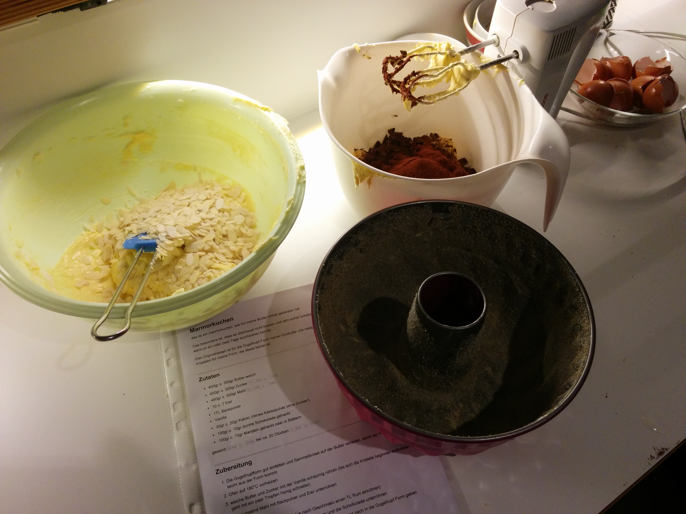
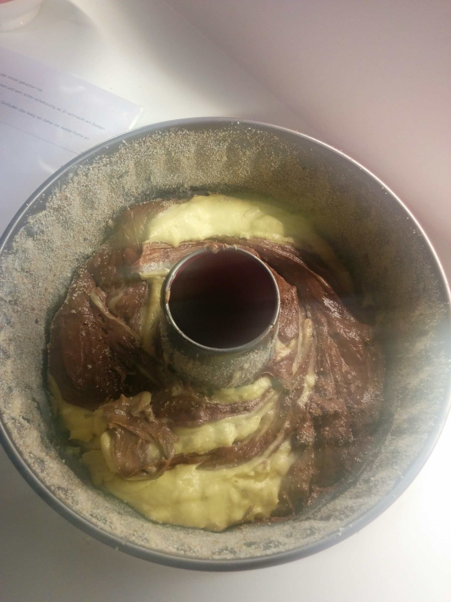
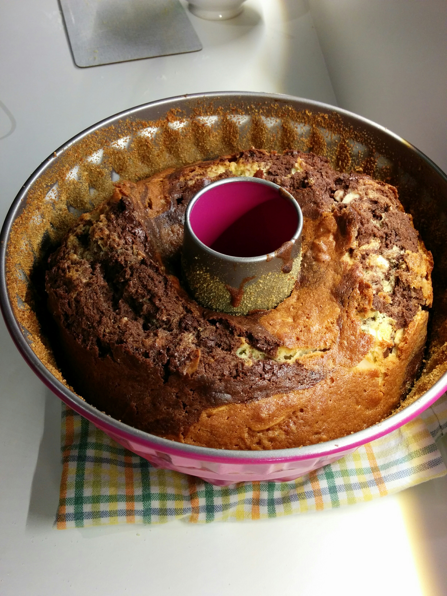

# Marmorkuchen

das ist ein marmorkuchen, wie ihn meine Mutter immer gebacken hat.

Das besondere ist, dass es überhaupt nicht trocken und sehr schön schokoladig ist. Er schmeckt 
am Besten, wenn er ein oder zwei Tage durchziehen konnte.

Das Originalrezept ist für die Gugelhupf-Form meiner Großutter (die riesig ist) daher die zweite Reihe an Angaben 
für meine Form, die etwas keiner ist 

## Zutaten

- 450gr o. 300gr Butter weich!
- 450gr o. 300gr Zucker `37,5Be o. 25BE`
- 450gr o. 300gr Mehl `22,5BE o. 18BE`
- eine Prise Salz
- 10 o. 7 Eier
- 1TL Backpulver
- Vanille
- etwas abgeriebene Zitronenschale
- 30gr o. 20gr Kakao (reines Kakaopulver ohne Zucker!)
- 100gr o. 70gr dunkle Schokolade gehackt ``
- 100gr o. 70gr Mandeln gehackt oder in Blättern

gesamt `60BE o. 43BE` bei ca. 20 Stücken `2-3BE je Stück`

## Zubereitung

1. Die Gugelhupfform gut einfetten und Semmelbrösel auf der Butter verteilen, damit der Kuchen möglichst leicht 
  aus der Form kommt 
1. Ofen auf 170°C vorheizen
1. weiche Butter und Zucker mit der Vanille schaumig rühren (bis sich die Kristalle beginnen aufzulösen,
  das geht mit ein paar Tropfen Honig schneller)
1. abwechselnd Mehl (mit dem Salz und Backpulver) und Eier unterrühren
1. Teig in zwei Schüsseln aufteilen
1. in eine Hälfte die Mandeln (und je nach Geschmack u.U. einen TL Rum einrühren)
  
1. in die andere Hälfte das gesiebte Kakaopulver und die Scholḱolade unterrühren
1. jeweils abwechselnd eine Hälfte der beiden Teige nach und nach in die Gugelhupf Form geben
1. mit einer Gabel spiralförmig miteinender vermengen
  
1. in den vorgeheizten Backofen geben und bei 170°C ca 55min backen
  
