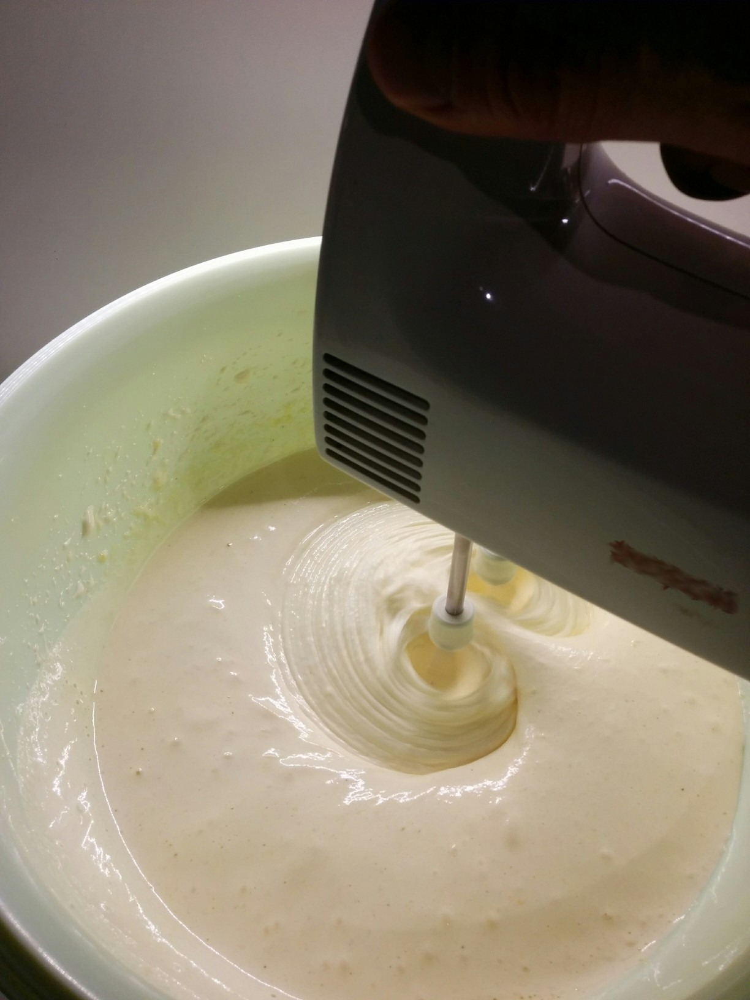

# Brownies with ground almonds

## Ingredients
- 600gr chocolate (~ 70-80% cocoa)
- 500gr butter
- 6 egg yolks and 4 whole eggs
- 440gr sugar
- 1 teaspoon of ground vanilla powder or 1 Vanilla bean
- 120gr flour
- 200gr ground toasted almonds (homemade is better, but you can buy ground almonds and it works too, for homemade ground almonds see [almond flour](/content/mandelmehl)).
- 3-5 table spoons of cocoa powder
- pinch of salt
- 300gr walnuts
- approx 100gr chocolate chips - if desired

## Preparation:

- toast walnuts at 170°C about 7 min in the oven
- melt the butter over low heat add vanilla and 600 gr chocolate in pieces, stir ocassionally.
  
  
- remove from the fire and allow to cool (until mixture is lukewarm)
- meanwhile, beat the 4 whole eggs and 6 egg yolks with the sugar until light and fluffy
  (until it is a white foamy mass and the sugar crystals are dissolved, test with your fingers -
  Tip: a small quantity of honey and the sugar will dissolve faster!!)
  
- mix flour, almonds and a pinch of salt
- add flour/almond mix alternately while stirring until the dough is quite smooth.
  
- add the sifted cocoa powder and stir in (more cocoa = more Chewyness)
- add the roasted walnuts
- put greaseproof paper on a wide baking form, and put the whole batter on, smooth it with a spoon.
  the batter should be roughly 3-4cm in the form, so you will get a nice chewy center
  
- bake at 175° C roughly 30 minutes (test with a wooden stick if baked, don't let it bake longer
  than absolutely necessary, the brownies will get dry!!)
- let it cool

the brownies will be very crumbly as long as they are warm so let it cool down(!)

if you are a chocolate purist add chocolate chips instead of walnuts (okay, Mr. L!), but i prefer the taste of the roasted nuts within the chocolate goodness

 
 

-----
(de version below)

#Brownies mit gemahlenen Mandeln

meine Lieblingsbrownies

##Zutaten:
- 600gr Schokolade (~70% Kakaogehalt)
- 450gr Butter
- 6 Eigelb und 4 ganze Eier
- 440gr Zucker
- Vanilleschote oder Pulver
- 120gr Mehl
- 200gr gemahlene geröstete Mandeln (selbstgemacht ist besser,
  gekauftes geht auch) s. [Mandelmehl](/content/mandelmehl)
- 3-5El Kakaopulver
- Prise Salz
- ca. 300 gr Walnüsse
- ca. 100gr gehackte Schokolade. als Zugabe, wenn noch gewünscht

##Zubereitung:

- Walnüsse bei 170°C ca. 7min im Ofen rösten
- Butter mit ausgekratzter Vanilleschote und der kleingebrochenen Schokolade bei
  milder Hitze schmelzen lassen.  
  
- Vom Feuer nehmen und abkühlen lassen (bis die Masse handwarm ist)
- Währenddessen die 4 ganze Eier und 6 Eigelb mit dem Zucker schaumig rühren (so lange
  bis eine fast  weiße schaumige Masse entstanden ist und sich die Zuckerkristalle darin
  aufgelöst haben - Tip: ein oder zwei Tropfen Honig zugeben, dann löst sich der Zucker
  schneller auf, man sollte den Zucker mit dem Finger nicht mehr spüren können!!)
  
- Mehl, Mandeln und die Prise Salz mischen
- Nach und nach abwechselnd Schokolade und Mehl-Mandel-Mischung unterrühren bis der Teig
  ganz glatt ist. 
- Das Kakaopulver auf die Masse sieben und auch unterheben (mehr Kakao = mehr Chewyness)
- Die gerösteten Nüsse unterheben.
- Backform mit Backpapier auslegen (auch den Rand!) und die Masse darauf verteilen.
  Die Masse sollte ca. 3-4cm hoch stehen, um einen weichen Kern zu bekommen.
  
- bei ca. 180° C ca. 30min backen (mit einem Holzstab testen, ob fertig, auf keinen Fall
  länger backen als notwendig, sonst werden die Brownies trocken!!)
- Abkühlen lassen und fertig.

Die Brownies sind - so lange sie warm sind - sehr(!) krümelig, daher lange genug abkühlen lassen.

Zusätzlich zu den Nüsse (oder auch anstatt Herr L.!) kann man auch die gehackte Schokolade unterheben.
